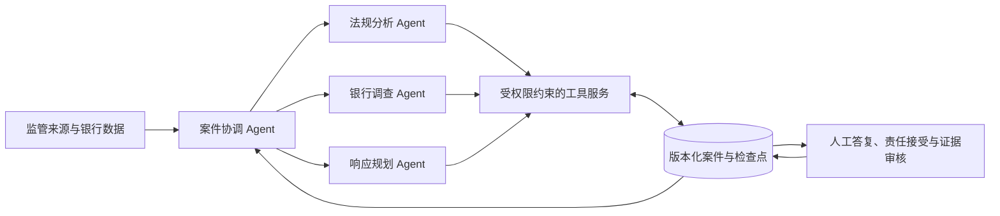

# Regulatory Change-to-Action

**将监管变化转化为可追溯、可分工、可审核的整改行动。**

一个面向银行合规与风险团队的多 Agent 决策支持原型。以 Northstar 数字银行的 SME ESG 信贷监测为场景，将法规来源、银行控制、业务访谈、响应方案和完成证据组织在同一个持久化案件中。

`Python` · `4 Agent roles` · `Tool calling` · `SQLite checkpoints` · `Human-in-the-loop`

## 项目解决什么问题

监管文件说明“应该做什么”，机构还需要回答：**影响哪些业务？现有控制能否覆盖？缺什么事实？由谁在何时完成？怎样证明已经完成？**

本项目围绕这些问题构建调查与行动闭环：

| 能力 | 具体实现 |
|---|---|
| 来源与适用性 | 登记监管来源、导入版本快照、解析引用，区分适用范围和生效日期 |
| 控制差异调查 | 检索政策与控制正文，保存有依据的候选映射和缺口 |
| 业务访谈 | 对缺失事实生成带负责人、单位、分母和日期的问题 |
| 响应规划 | 比较方案成本，起草限定范围的行动、责任候选、内部目标日及证据要求 |
| 证据审核 | 文件 hash、内容判断、人工确认/退回、任务级结案检查 |
| 可恢复执行 | 版本化案件、工具检查点、依赖失效更新及哈希链审计 |

## 一条命令体验完整案例

使用 Python 3.12+，在项目根目录运行：

```bash
python3 scripts/demo.py
```

默认演示使用**内置场景回放**，无需 API key 或第三方依赖。它执行与模型模式相同的业务工具和状态服务，并以明确标记的模拟答复与审核决定展示：

1. 建立 ESG 案件，保存来源和候选适用范围。
2. 识别“新申请筛查”与“存量持续监测”的控制范围差异。
3. 提出能源数据问题，接收模拟答复，更新相关发现。
4. 比较条件性成本，生成行动草案并模拟责任接受。
5. 拒绝不相关证据，补交设计与测试材料，完成窄任务的审核与结案。

结果写入 `runs/demo/`：

| 文件 | 用途 |
|---|---|
| `report.md` | 可直接阅读的案例报告 |
| `summary.json` | 发现、方案、行动、证据及检查结果 |
| `workflow.json` / `audit.json` | 执行阶段与审计事件 |
| `cases.sqlite3` | 可继续查询的案件数据库 |

也可先阅读 [示例报告](examples/esg_demo_report.md) 或 [演示讲解](docs/demo.md)。

## 系统架构



| Agent | 核心职责 |
|---|---|
| 案件协调 | 根据案件目标和当前状态分配调查任务、汇总结果 |
| 法规分析 | 核对要求、引用、来源版本、候选范围和日期 |
| 银行调查 | 调查控制、业务事实及依赖关系，审核证据内容 |
| 响应规划 | 调用成本与角色工具，提出方案和行动草案 |

采用 **Supervisor–Specialist** 协作方式：四个逻辑角色共用可配置模型，运行于单进程自定义 Python 编排层。角色通过结构化委派和共享案件状态协作，当前串行调度。模型负责调查选择与候选解释，代码负责计算和校验，关键决定保留人工审核入口。

检索使用本地记录索引、关键词排序和按 ID 读取；每个任务维护已观察引用，保存发现时验证出处。详见 [架构设计](docs/architecture.md)。

## 接入模型与案件恢复

完整开发环境：

```bash
python3 -m venv .venv
source .venv/bin/activate
python -m pip install -r requirements.txt
```

模型配置参考 [.env.example](.env.example)。首次配置可从终端环境写入本地文件；该命令不覆盖已有配置，也不打印密钥：

```bash
# 先在当前终端设置 LLM_API_KEY
python agent/configure_llm.py --from-env --provider openai --model gpt-5

# 按账户限额设置请求预算；此命令产生模型 API 使用量
python agent/run_case.py --db runs/live/cases.sqlite3 \
  --max-model-calls 12 --max-seconds 180 \
  --max-request-tokens 10000 --tokens-per-minute 10000 \
  start --mode live
```

查询和续跑使用返回的案件 ID：

```bash
python agent/run_case.py --db runs/live/cases.sqlite3 show CASE_ID --audit
python agent/run_case.py --db runs/live/cases.sqlite3 \
  --max-model-calls 12 --max-seconds 180 \
  --max-request-tokens 10000 --tokens-per-minute 10000 resume CASE_ID
```

Live 模式用于预算受控的模型调查和断点恢复；默认完整演示采用场景回放。OpenAI 与 Anthropic 兼容服务通过统一 adapter 接入，执行模式始终显式标记。用法与验证范围见 [开发说明](docs/development.md)。

## 验证与提交

```bash
# 在已安装 requirements.txt 的环境中
make check
make package
```

`make check` 运行自动化测试、数据校验和完整场景演示。`make package` 生成 `dist/regulatory-change-to-action.zip`，附文件级 SHA-256 清单和压缩包校验值；本地配置、运行记录、虚拟环境及备份不进入提交包。最新执行结果见 [验证记录](docs/validation.md)。

## 项目结构

```text
agent/              角色、工具、编排、检查点、案件存储及本地 JSON API
scripts/            演示入口、数据校验、构建及提交打包
calibrated_v0_2/     版本化机构与监管场景数据
materials/esg_demo/  模拟业务答复和证据材料
config/             方法配置与数据迁移记录
docs/               架构、演示和开发说明
examples/           可阅读的演示产物
```

## 数据与原型范围

Northstar 是虚构银行，业务答复和演示证据均带模拟标记；bunq 仅作为公开同业参考。场景固定于 2026-09-08，保留原始数据快照日期。法规原文、候选解释和人工决定分别记录，关闭一项行动仅代表该项任务的审核结果。

交付以 SME ESG 案件的 CLI 和本地 JSON API 为核心，采用人工审核的决策支持方式。原始项目要求见 [require.md](require.md)，数据字段和来源见 [数据字典](calibrated_v0_2/DATA_DICTIONARY.md) 与 [资料说明](docs/data-and-sources.md)。
