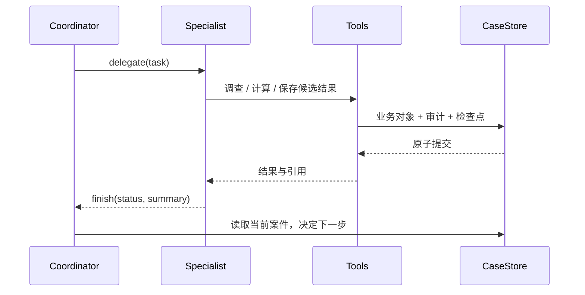

# Architecture

Regulatory Change-to-Action 采用以案件为中心的 Supervisor–Specialist 架构。四个逻辑 Agent 在一个 Python 进程内通过结构化工具调用协作，SQLite 保存共享业务状态与任务检查点。

## 1. 职责分层

| 层 | 负责内容 | 主要模块 |
|---|---|---|
| 模型适配 | 统一文本/工具调用及 usage 响应 | `agent/llm.py` |
| 编排运行时 | 模型循环、专家委派、权限、预算和有限重试 | `tool_runtime.py`、`task_execution.py` |
| 调查服务 | 检索、引用、适用性、控制映射、访谈和方案工具 | `investigation_tools.py` |
| 确定性计算 | 分母、成本、日期、范围和证据状态校验 | `scripts/dataset_runtime.py` 等 |
| 状态与恢复 | 版本化案件、嵌套事务、检查点和哈希链审计 | `case_store.py`、`task_checkpoint.py` |
| 人工与展示 | 事实答复、责任接受、证据决定、JSON 视图 | `run_case.py`、`view_adapter.py`、`api_server.py` |

角色工具由允许清单限定，所有调用经 schema 校验后执行。模型没有任意代码执行、直接数据库写入或人工批准权限。来源与工具返回的文档内容按数据处理。

## 2. 四个 Agent

**Coordinator** 查看当前目标、发现和问题，选择专家任务并汇总结果。工具限于 `case_context`、`delegate`、`check_closure`、`finish`。

**Regulatory Analyst** 读取要求、引用与来源快照，调用版本和适用性工具，保存候选范围、日期与来源发现。

**Bank Investigator** 查询治理正文，区分新申请控制与存量监测，追踪业务依赖，询问缺失事实，并根据实际文件审查证据内容。

**Response Planner** 调用成本、依赖与角色工具，提出范围明确的计划及行动，记录负责人候选、目标日期和验收材料。成本模板当前覆盖 DATA-GAPS 与 CREDIT-MONITORING。

角色使用独立任务上下文和工具权限，可共用同一个模型客户端。编排采用同步委派，不要求每个案件固定按四个角色的顺序执行。

## 3. 状态传递与记忆

协调通过 `delegate(role, task, task_key)` 传入任务，专家的 `finish` 结果作为工具响应返回。业务结果保存进共享案件，再通过 `case_context` 等工具读取。

核心对象为：

```text
Case
 ├── SourceVersion
 ├── Task → checkpoint / observations / pending tool cursor
 ├── Finding → references / dependencies / review status
 ├── Question → FactPatch
 ├── GapAssessment
 └── PlanVersion → Action → Evidence
```

每个任务保存消息、工具观察、已读取引用、事实查询记录与循环计数，形成案件级持久记忆。恢复时校验输入版本、角色合同和检查点 hash。请求上下文按预算压缩；原始工具结果仍可从本地记录追溯。

关键语义是“已保存到案件”与“当前专家实际核查过该引用”分别管理。跨案件经验学习不属于当前原型范围。

## 4. 事务与恢复

一次业务工具写入、对应审计和工具游标推进放在同一事务中；嵌套服务通过 SQLite savepoint 保持回滚一致性。模型请求和限流等待在事务之外执行。

专家子任务独立提交。因此即使父任务在接收结果时中断，恢复后也可复用已经完成的子任务。来源/事实 revision 或角色合同变化时创建新的任务上下文；已有业务对象通过依赖关系失效和更新。



## 5. 检索与证据

检索采用允许目录内的结构化记录索引。关键词排序先返回候选摘要，按 ID 读取完整记录后再判断范围。工具维护当前任务的已观察引用；控制映射要求实际读取要求与控制正文。

来源工具区分登记记录、整理转述和导入的原始快照。关系遍历使用数据中登记的 ID 连接。证据文件保存 hash、类型、任务归属和版本，内容判断与人工最终决定分别记录。

## 6. 人工决策边界

事实答复携带角色、日期、单位及分母，写入 FactPatch；依赖该事实的发现/计划失效后重新调查。角色候选来自登记 RACI，责任接受通过独立人工入口完成。

行动的内部目标日期与原监管日期分别保存。证据审核保留拒绝、重新提交和新版本决定；关闭行动只适用于该项任务，不能扩展为机构层面的合规批准。

CLI 与本地 JSON API 复用同一业务服务。场景回放为这些人工入口提供明确标记的模拟决定；模型模式保留人工操作边界。

## 7. 验证和演示

默认完整演示：`python3 scripts/demo.py`，使用 synthetic 场景回放并输出报告、JSON 和 SQLite。Live 模式提供模型驱动的调查和恢复。检查结果见 [验证记录](validation.md)，演示操作见 [Demo walkthrough](demo.md)，研发评估范围见 [开发说明](development.md)。
